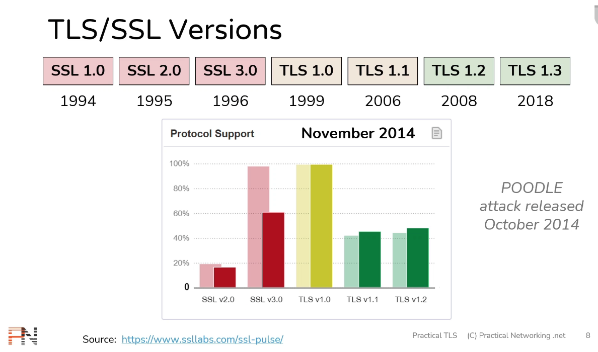

# TLS/SSL versions (part 1)

The terms "SSL" and "TLS" are mostly interchangeable, but when referring to their versions, it is important to include "SSL" or "TLS." 
This is because after `SSL 3.0`, the version number starts from `1.0` as `TLS 1.0`.

## TLS/SSL version evolve as patch are added when valnerability is discovered

Case study Poodle attack [ [POODLE - Wikipedia](https://en.wikipedia.org/wiki/POODLE) ] 

https://www.ssllabs.com/ssl-pulse/

Poodle vulnerability was announced publicly on October 14, 2014, To mitigate the POODLE attack, one approach is to completely disable SSL 3.0 on the client side and the server side.  As you can see use of SSL v3.0 is reduce drastically from previous month (light shade of red).

 
