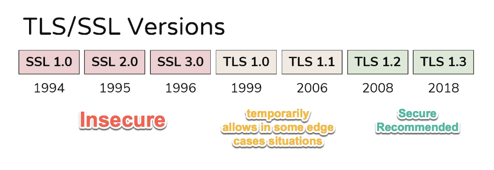
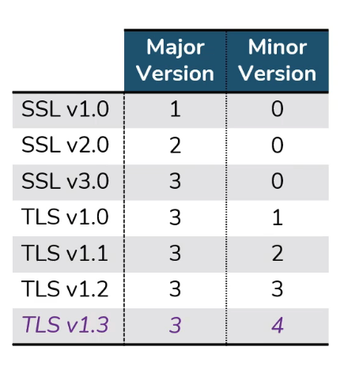

# TLS/SSL versions (part 2)

video link:  [TLS/SSL versions (part 2)](https://classes.pracnet.net/courses/practical-tls/contents/6098663724bc8) 

statistic link: https://www.ssllabs.com/ssl-pulse/

## SSL

### SSL v1.0

- **Insecure**
- Developed by Netscape
- Never publicly released
- Full of flaws

### SSL v2.0

- **Insecure**
- Developed by Netscape
- Complete redesign of SSL v1.0
- Still full of flaws

  
### SSL v3.0
- **Insecure**
- Predominant version of SSL until POODLE attact in OCT 2014
- Complete redesign of SSL v2.0 by Netscape
- Foundation of TLS versions we use today
- RFC 6101, Historical copy of original SSL3.0 draft from 1996

## TLS

TLS v1.0 is the new name for SSL v3.1

### TLS v1.0

- **Deprecated March 2021 (RFC 8996)**
- RFC 2246
- Major vulnerability: BEAST (attack on CBC ciphers) [see foot note]

### TLS v1.1

- **Deprecated March 2021 (RFC 8996)**
- RFC 4346 (original spec)
- Patch BEAST attack on CBC ciphers 
- It will not approve for most compliance certifications (HIPAA, PCI, NIST, etc [see foot note]), although it allows in some edge cases situations temporarily.

### TLS v1.2

- RFC 5246 
- **Secure Recommended**

### TLS v1.3

- RFC 8446
- Major changes from TLS v1.2
- Favors security and simplicity over backwards compatibility
- **Secure Recommended**

---

## Foot note

HIPAA - Health Insurance Portability and Accountability Act
PCI - Payment Card Industry
NIST - National Institute of Standards and Technology

## BEAST attack to read:

 [How the BEAST Attack Works | Invicti](https://www.invicti.com/blog/web-security/how-the-beast-attack-works/) 

 [BEAST Attack Explained. BEAST stands for (Browser Exploit… | by c0D3M | Medium](https://medium.com/@c0D3M/beast-attack-explained-f272acd7996e) 

 [BEAST Attack Explained - YouTube](https://www.youtube.com/watch?v=J8F5VvTS8R8) 